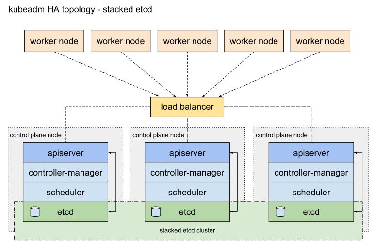
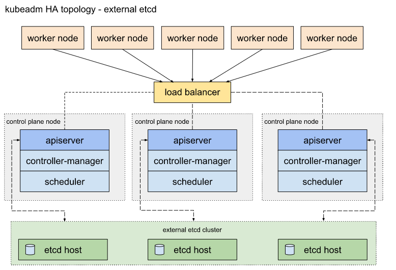

# kubeadm安装

官网地址

https://kubernetes.io/zh/docs/setup/production-environment/tools/kubeadm/install-kubeadm/

使用kubeadm工具快速安装kubernetes集群

## 系统要求

## centos8网络服务
1.重启网卡之前一定要重新载入一下配置文件，不然不能立即生效

```shell
nmcli c reload
```

2.重启网卡（下面的三条命令都可以）：

```shell
nmcli c up eth0
nmcli d reapply eth0
nmcli d connect eth0
```

总结：重启centos8的网卡，先载入新的配置文件，然后在执行重启网卡命令即可。

## 时间

```shell
yum install -y chrony
chronyd -q 'server ntp1.aliyun.com iburst'
vim /etc/chrony.conf
第三行替换 server ntp.aliyun.com iburst
systemctl restart chronyd.service
systemctl enable chronyd.service
```


### 防火墙

```shell
systemctl stop firewalld
setenforce 0

systemctl stop firewalld.service
systemctl disable firewalld.service
```

### 主机名解析

cat /etc/hosts

### 修改内核参数

```shell
cat <<EOF >  /etc/sysctl.d/k8s.conf
net.bridge.bridge-nf-call-ip6tables = 1
net.bridge.bridge-nf-call-iptables = 1
EOF
sysctl --system
```

## kubeadm安装

由于官方源无法访问这里使用阿里源安装

`https://developer.aliyun.com/mirror/kubernetes?spm=a2c6h.13651102.0.0.3e221b112axXAz`

```shell
# 配置yum源
cat <<EOF > /etc/yum.repos.d/kubernetes.repo
[kubernetes]
name=Kubernetes
baseurl=https://mirrors.aliyun.com/kubernetes/yum/repos/kubernetes-el7-x86_64/
enabled=1
gpgcheck=1
repo_gpgcheck=1
gpgkey=https://mirrors.aliyun.com/kubernetes/yum/doc/yum-key.gpg https://mirrors.aliyun.com/kubernetes/yum/doc/rpm-package-key.gpg
EOF

# 安装相关组件
yum install -y kubelet kubeadm kubectl
systemctl enable kubelet && systemctl start kubelet

# 安装docker
	# step 1: 安装必要的一些系统工具
yum install -y yum-utils device-mapper-persistent-data lvm2
	# Step 2: 添加软件源信息
yum-config-manager --add-repo https://mirrors.aliyun.com/docker-ce/linux/centos/docker-ce.repo
	# Step 3: 更新并安装Docker-CE
yum makecache fast
yum -y install docker-ce
	# Step 4: 开启Docker服务
systemctl enable docker
systemctl start docker
```

### 忽略swap

```shell
# vim /etc/sysconfig/kubelet
KUBELET_EXTRA_ARGS="--fail-swap-on=false"
```

kubeadm将配置文件以ConfigMap形式保存在集群之中，便于后续的查询和升级工作。kubeadm字命令提供了对这一组功能的支持

```shell
# 由配置文件上传到急群众生成ConfigMap
kubeadm config upload from-file
# 由配置参数生成ConfigMap
kubeadm config upload from-flags
# 查看当前急群众的配置值
kubeadm config view
# 输出kubeadm init默认参数文件的内容
kubeadm config print init-defaults > init.default.yaml
# 输出kubeadm join默认参数文件的内容
kubeadm config print join-defaults
# 在新旧版本之间进行配置转换
kubeadm config migrate
# 列出所需的镜像列表
kubeadm config images list
# 拉去镜像到本地
kubeadm config images pull
```

## kubeadm init初始化流程

https://kubernetes.io/zh/docs/reference/setup-tools/kubeadm/kubeadm-init/

## 下载kubernets的相关镜像

由于k8s.gcr.io无法访问导致节点初始化报错，可以使用国内的镜像托管站点获得镜像加速支持

* 修改docker的配置文件，增加registry mirror参数，将将向配置写入配置参数中(现在阿里源下载docker自动配置阿里加速)

  ```shell
  vim /etc/docker/daemon.json
  {
    "registry-mirrors": ["https://abt201l5.mirror.aliyuncs.com"]
  }
  ```

使用kubeadm config命令下载所需镜像

```shell
kubeadm config print init-defaults > init.default.yaml
kubeadm config images pull --config=init.default.yaml

## 直接下载由于网络问题会超时报错
```

查看初始化所需镜像

```shell
kubeadm config images list
#k8s.gcr.io/kube-apiserver:v1.20.2
#k8s.gcr.io/kube-controller-manager:v1.20.2
#k8s.gcr.io/kube-scheduler:v1.20.2
#k8s.gcr.io/kube-proxy:v1.20.2
#k8s.gcr.io/pause:3.2
#k8s.gcr.io/etcd:3.4.13-0
#k8s.gcr.io/coredns:1.7.0
```

下载镜像  下方两种都可以使用

```shell
docker pull registry.aliyuncs.com/google_containers/kube-apiserver:v1.20.2
docker pull docker.io/mirrorgooglecontainers/kube-apiserver:v1.20.2  // 最新版本同步不及时
```

```shell
# 下载镜像
docker pull registry.aliyuncs.com/google_containers/kube-apiserver:v1.20.2
docker pull registry.aliyuncs.com/google_containers/kube-controller-manager:v1.20.2
docker pull registry.aliyuncs.com/google_containers/kube-scheduler:v1.20.2
docker pull registry.aliyuncs.com/google_containers/kube-proxy:v1.20.2
docker pull registry.aliyuncs.com/google_containers/pause:3.2
docker pull registry.aliyuncs.com/google_containers/etcd:3.4.13-0
docker pull registry.aliyuncs.com/google_containers/coredns:1.7.0

# 修改tag
docker tag registry.aliyuncs.com/google_containers/kube-apiserver:v1.20.2 k8s.gcr.io/kube-apiserver:v1.20.2
docker tag registry.aliyuncs.com/google_containers/kube-controller-manager:v1.20.2 k8s.gcr.io/kube-controller-manager:v1.20.2
docker tag registry.aliyuncs.com/google_containers/kube-scheduler:v1.20.2 k8s.gcr.io/kube-scheduler:v1.20.2
docker tag registry.aliyuncs.com/google_containers/kube-proxy:v1.20.2 k8s.gcr.io/kube-proxy:v1.20.2
docker tag registry.aliyuncs.com/google_containers/pause:3.2 k8s.gcr.io/pause:3.2
docker tag registry.aliyuncs.com/google_containers/etcd:3.4.13-0 k8s.gcr.io/etcd:3.4.13-0
docker tag registry.aliyuncs.com/google_containers/coredns:1.7.0 k8s.gcr.io/coredns:1.7.0
```

## 初始化master

### 获取默认初始化参数文件

```go
kubeadm config print init-defaults > kubeadm-config.yaml
```

使用参数文件舒适化master

 ```go
kubeadm init --config kubeadm-config.yaml --upload-certs
 ```


### 传参初始化（此处这么安装）

`这里初始化由于没有从group pis 升级了内核5.x`

** 规划好pod service 网络

```shell
kubeadm init --kubernetes-version=v1.20.2 --pod-network-cidr=10.244.0.0/16 --service-cidr=10.96.0.0/12 --ignore-preflight-errors=Swap
```


## 替换默认为1年的证书

https://zhuanlan.zhihu.com/p/150001642


## 安装node，加入集群

同master安装相同

```shell
docker load < etcd.tar.gz
docker load < kube-apiserver.tar.gz
docker load < kube-controller-manager.tar.gz
docker load < kube-proxy.tar.gz
docker load < kube-scheduler.tar.gz
docker load < pause.tar.gz
docker load < coredns.tar.gz
```

node加入集群

```shell
kubeadm join 10.0.0.10:6443 --token etchbt.7k8ztgai864jeuws --discovery-token-ca-cert-hash sha256:b286845d72c2ee6a760971bcc7b52e3e5a127068573b279522fe7c5c512a9c14 --ignore-preflight-errors=Swap
```


## 忘记token

* **忘记sha256串**

  拿到查看的token加新生成的串可加入集群

```shell
# 查看token
kubeadm token list
# 生成sha256
openssl x509 -pubkey -in /etc/kubernetes/pki/ca.crt | openssl rsa -pubin -outform der 2>/dev/null | openssl dgst -sha256 -hex | sed 's/^.* //'
# 加入node
kubeadm join 主节点ip:6443 --token 新的token \
--discovery-token-ca-cert-hash sha256:上个命令生成的字符串 \
--ignore-preflight-errors=Swap
```

* **生成一个新的token**

```shell
kubeadm token create --print-join-command //默认有效期24小时,若想久一些可以结合--ttl参数,设为0则用不过期
```


### 安装网络插件

执行`kubectl get nodes`提示`NotReady`状态，需要安装网络插件才能正常通信

根据kubeadm提供安装插件地址选择合适插件 ini后就有输出

```shell
https://kubernetes.io/docs/concepts/cluster-administration/addons/
```

权威指南使用veave，这里使用`Flannel 是一个可以用于 Kubernetes 的 overlay 网络提供者。`

https://github.com/coreos/flannel

https://github.com/coreos/flannel/blob/master/Documentation/kube-flannel.yml

```shell
kubectl apply -f https://raw.githubusercontent.com/coreos/flannel/master/Documentation/kube-flannel.yml
```

* 镜像下载失败

  `kubectl describe pods kube-flannel-ds-2p6s4 -n kube-system`

  ```shell
    Normal   Scheduled    73s                default-scheduler  Successfully assigned kube-system/kube-flannel-ds-2p6s4 to master
    Warning  FailedMount  72s                kubelet            MountVolume.SetUp failed for volume "flannel-token-2q9nt" : failed to sync secret cache: timed out waiting for the condition
    Warning  Failed       52s                kubelet            Failed to pull image "quay.io/coreos/flannel:v0.13.1-rc1": rpc error: code = Unknown desc = Error response from daemon: Get https://quay.io/v2/: net/http: request canceled (Client.Timeout exceeded while awaiting headers)
    Normal   Pulling      37s (x2 over 67s)  kubelet            Pulling image "quay.io/coreos/flannel:v0.13.1-rc1"
    Warning  Failed       23s (x2 over 52s)  kubelet            Error: ErrImagePull
    Warning  Failed       23s                kubelet            Failed to pull image "quay.io/coreos/flannel:v0.13.1-rc1": rpc error: code = Unknown desc = Error response from daemon: Get https://quay.io/v2/: net/http: TLS handshake timeout
    Normal   BackOff      11s (x2 over 51s)  kubelet            Back-off pulling image "quay.io/coreos/flannel:v0.13.1-rc1"
    Warning  Failed       11s (x2 over 51s)  kubelet            Error: ImagePullBackOff
  ```

直接取github下载

https://github.com/coreos/flannel/releases

[flanneld-v0.13.1-rc1-amd64.docker](https://github.com/coreos/flannel/releases/download/v0.13.1-rc1/flanneld-v0.13.1-rc1-amd64.docker)


## 相关输出记录

### kubeadm init输出记录

```shell
[root@master ~]# uname -sr
Linux 5.10.9-1.el7.elrepo.x86_64
[root@master ~]# kubeadm init --kubernetes-version=v1.20.2 --pod-network-cidr=10.244.0.0/16 --service-cidr=10.96.0.0/12 --ignore-preflight-errors=Swap
[init] Using Kubernetes version: v1.20.2
[preflight] Running pre-flight checks
	[WARNING IsDockerSystemdCheck]: detected "cgroupfs" as the Docker cgroup driver. The recommended driver is "systemd". Please follow the guide at https://kubernetes.io/docs/setup/cri/
	[WARNING SystemVerification]: this Docker version is not on the list of validated versions: 20.10.2. Latest validated version: 19.03
[preflight] Pulling images required for setting up a Kubernetes cluster
[preflight] This might take a minute or two, depending on the speed of your internet connection
[preflight] You can also perform this action in beforehand using 'kubeadm config images pull'
^C
[root@master ~]# kubeadm init --kubernetes-version=v1.20.2 --pod-network-cidr=10.244.0.0/16 --service-cidr=10.96.0.0/12 --ignore-preflight-errors=Swap
[init] Using Kubernetes version: v1.20.2
[preflight] Running pre-flight checks
	[WARNING IsDockerSystemdCheck]: detected "cgroupfs" as the Docker cgroup driver. The recommended driver is "systemd". Please follow the guide at https://kubernetes.io/docs/setup/cri/
	[WARNING SystemVerification]: this Docker version is not on the list of validated versions: 20.10.2. Latest validated version: 19.03
[preflight] Pulling images required for setting up a Kubernetes cluster
[preflight] This might take a minute or two, depending on the speed of your internet connection
[preflight] You can also perform this action in beforehand using 'kubeadm config images pull'
[certs] Using certificateDir folder "/etc/kubernetes/pki"
[certs] Generating "ca" certificate and key
[certs] Generating "apiserver" certificate and key
[certs] apiserver serving cert is signed for DNS names [kubernetes kubernetes.default kubernetes.default.svc kubernetes.default.svc.cluster.local master] and IPs [10.96.0.1 10.0.0.10]
[certs] Generating "apiserver-kubelet-client" certificate and key
[certs] Generating "front-proxy-ca" certificate and key
[certs] Generating "front-proxy-client" certificate and key
[certs] Generating "etcd/ca" certificate and key
[certs] Generating "etcd/server" certificate and key
[certs] etcd/server serving cert is signed for DNS names [localhost master] and IPs [10.0.0.10 127.0.0.1 ::1]
[certs] Generating "etcd/peer" certificate and key
[certs] etcd/peer serving cert is signed for DNS names [localhost master] and IPs [10.0.0.10 127.0.0.1 ::1]
[certs] Generating "etcd/healthcheck-client" certificate and key
[certs] Generating "apiserver-etcd-client" certificate and key
[certs] Generating "sa" key and public key
[kubeconfig] Using kubeconfig folder "/etc/kubernetes"
[kubeconfig] Writing "admin.conf" kubeconfig file
[kubeconfig] Writing "kubelet.conf" kubeconfig file
[kubeconfig] Writing "controller-manager.conf" kubeconfig file
[kubeconfig] Writing "scheduler.conf" kubeconfig file
[kubelet-start] Writing kubelet environment file with flags to file "/var/lib/kubelet/kubeadm-flags.env"
[kubelet-start] Writing kubelet configuration to file "/var/lib/kubelet/config.yaml"
[kubelet-start] Starting the kubelet
[control-plane] Using manifest folder "/etc/kubernetes/manifests"
[control-plane] Creating static Pod manifest for "kube-apiserver"
[control-plane] Creating static Pod manifest for "kube-controller-manager"
[control-plane] Creating static Pod manifest for "kube-scheduler"
[etcd] Creating static Pod manifest for local etcd in "/etc/kubernetes/manifests"
[wait-control-plane] Waiting for the kubelet to boot up the control plane as static Pods from directory "/etc/kubernetes/manifests". This can take up to 4m0s
[apiclient] All control plane components are healthy after 30.502579 seconds
[upload-config] Storing the configuration used in ConfigMap "kubeadm-config" in the "kube-system" Namespace
[kubelet] Creating a ConfigMap "kubelet-config-1.20" in namespace kube-system with the configuration for the kubelets in the cluster
[upload-certs] Skipping phase. Please see --upload-certs
[mark-control-plane] Marking the node master as control-plane by adding the labels "node-role.kubernetes.io/master=''" and "node-role.kubernetes.io/control-plane='' (deprecated)"
[mark-control-plane] Marking the node master as control-plane by adding the taints [node-role.kubernetes.io/master:NoSchedule]
[bootstrap-token] Using token: etchbt.7k8ztgai864jeuws
[bootstrap-token] Configuring bootstrap tokens, cluster-info ConfigMap, RBAC Roles
[bootstrap-token] configured RBAC rules to allow Node Bootstrap tokens to get nodes
[bootstrap-token] configured RBAC rules to allow Node Bootstrap tokens to post CSRs in order for nodes to get long term certificate credentials
[bootstrap-token] configured RBAC rules to allow the csrapprover controller automatically approve CSRs from a Node Bootstrap Token
[bootstrap-token] configured RBAC rules to allow certificate rotation for all node client certificates in the cluster
[bootstrap-token] Creating the "cluster-info" ConfigMap in the "kube-public" namespace
[kubelet-finalize] Updating "/etc/kubernetes/kubelet.conf" to point to a rotatable kubelet client certificate and key
[addons] Applied essential addon: CoreDNS
[addons] Applied essential addon: kube-proxy

Your Kubernetes control-plane has initialized successfully!

To start using your cluster, you need to run the following as a regular user:

  mkdir -p $HOME/.kube
  sudo cp -i /etc/kubernetes/admin.conf $HOME/.kube/config
  sudo chown $(id -u):$(id -g) $HOME/.kube/config

Alternatively, if you are the root user, you can run:

  export KUBECONFIG=/etc/kubernetes/admin.conf

You should now deploy a pod network to the cluster.
Run "kubectl apply -f [podnetwork].yaml" with one of the options listed at:
  https://kubernetes.io/docs/concepts/cluster-administration/addons/

Then you can join any number of worker nodes by running the following on each as root:

kubeadm join 10.0.0.10:6443 --token etchbt.7k8ztgai864jeuws \
    --discovery-token-ca-cert-hash sha256:b286845d72c2ee6a760971bcc7b52e3e5a127068573b279522fe7c5c512a9c14
```

## 加入集群输出

```shell
[root@node1 ~]# kubeadm join 10.0.0.10:6443 --token etchbt.7k8ztgai864jeuws  --discovery-token-ca-cert-hash sha256:b286845d72c2ee6a760971bcc7b52e3e5a127068573b279522fe7c5c512a9c14 --ignore-preflight-errors=Swap
[preflight] Running pre-flight checks
	[WARNING IsDockerSystemdCheck]: detected "cgroupfs" as the Docker cgroup driver. The recommended driver is "systemd". Please follow the guide at https://kubernetes.io/docs/setup/cri/
	[WARNING SystemVerification]: this Docker version is not on the list of validated versions: 20.10.2. Latest validated version: 19.03
[preflight] Reading configuration from the cluster...
[preflight] FYI: You can look at this config file with 'kubectl -n kube-system get cm kubeadm-config -o yaml'
[kubelet-start] Writing kubelet configuration to file "/var/lib/kubelet/config.yaml"
[kubelet-start] Writing kubelet environment file with flags to file "/var/lib/kubelet/kubeadm-flags.env"
[kubelet-start] Starting the kubelet
[kubelet-start] Waiting for the kubelet to perform the TLS Bootstrap...

This node has joined the cluster:
* Certificate signing request was sent to apiserver and a response was received.
* The Kubelet was informed of the new secure connection details.

Run 'kubectl get nodes' on the control-plane to see this node join the cluster.
```


## 报错

### kubeadm安装 cgroup pids报错

低版本内核没有cgroups pids造成

```shell
CGROUPS_MEMORY: enabled
CGROUPS_PIDS: missing
CGROUPS_HUGETLB: enabled
	[WARNING SystemVerification]: this Docker version is not on the list of validated versions: 20.10.2. Latest validated version: 19.03
error execution phase preflight: [preflight] Some fatal errors occurred:
	[ERROR SystemVerification]: missing required cgroups: pids
	[ERROR KubeletVersion]: the kubelet version is higher than the control plane version. This is not a supported version skew and may lead to a malfunctional cluster. Kubelet version: "1.20.2" Control plane version: "1.19.7"
[preflight] If you know what you are doing, you can make a check non-fatal with `--ignore-preflight-errors=...`
To see the stack trace of this error execute with --v=5 or higher
```

 在Linux Kernel 4.3中，引入了一个新的cgroups子系统`pids`，通过这个子系统，可以实现对某个控制组中进程和线程的总数进行限制。 

cgroup pids说明

http://www.ichenfu.com/2017/04/25/cgroups-pids-controller/

内核升级

https://www.cnblogs.com/xzkzzz/p/9627658.html

### coredns 安装污点，not-reday

coredns安装失败，导致coredns不能安装，集群node Ready后可安装


书里的坑总结

https://blog.csdn.net/isea533/article/details/86769125


# kubeadm 高可用（内置etcd）

https://kubernetes.io/zh/docs/setup/production-environment/tools/kubeadm/high-availability/

P709



### 环境准备

2个以上cpu

- 配置三台机器 [kubeadm 的最低要求](https://kubernetes.io/zh/docs/setup/production-environment/tools/kubeadm/install-kubeadm/#before-you-begin) 给主节点
- 配置三台机器 [kubeadm 的最低要求](https://kubernetes.io/zh/docs/setup/production-environment/tools/kubeadm/install-kubeadm/#before-you-begin) 给工作节点
- 在集群中，所有计算机之间的完全网络连接（公网或私网）
- 所有机器上的 sudo 权限
- 每台设备对系统中所有节点的 SSH 访问
- 在所有机器上安装 `kubeadm` 和 `kubelet`，`kubectl` 是可选的。

kubead提供了两种不同的高可用方案

* 堆叠方案

  etcd服务和控制平面被部署在同样的节点中，对基础设置的要求较低，对故障的应对能力也较低

* 外置etcd方案

  etcd和控制平面分离，需要更多的硬件，也有更好的保障能力

环境准备：

* haproxy

  ```shell
  10.0.0.10
  ```

* master

  ```shell
  10.0.0.10 master1
  10.0.0.11 master2
  10.0.0.12 master3
  ```

* node

  ```shell
  10.0.0.13 node1
  ```

  

master配置ssh互相认证

### haproxy代码master

**官方推荐dns解析不同master节点做高可用**

安装并配置haproxy转发后端mater节点

```shell
yum install haproxy

systemctl enable haproxy
```

`vim /etc/haproxy/haproxy.cfg`

```shell
frontend k8s-cluster-a
    bind 0.0.0.0:12345
#listen stats 0.0.0.0:12345
    mode      http
    log       global
    maxconn   10
    stats     enable
    stats     hide-version
    stats     refresh 30s
    stats     show-node
    stats     auth  admin:111111
    stats     uri   /stats
frontend    kube-api-https
    bind    0.0.0.0:12567
    mode    tcp
    default_backend  kube-api-server
backend    kube-api-server
    balance    roundrobin
    mode    tcp
    server  kubenode1    10.0.0.10:6443    check
    server  kubenode2    10.0.0.11:6443    check
    server  kubenode3    10.0.0.12:6443    check
```

访问 http://10.0.0.10:12345/stats  后端没动显示down状态


### 初始化一个节点

* 创建一个用于初始化集群的配置文件kubeadm_config.yaml

  **<font color=FF0000>书中版本apiVersion: kubeadm.k8s.io/v1beta2有问题</font>**

  这里不使用配置文件直接参数指定,由于镜像下载问题，暂时使用一个老版本安装

  ```go
  kubeadm init --kubernetes-version=v1.20.2  --upload-certs
  ```

  ```go
  kubeadm init --kubernetes-version=v1.20.2 \
  --control-plane-endpoint "10.0.0.10:12567" \
  --pod-network-cidr=10.244.0.0/16 \
  --service-cidr=10.96.0.0/12 \
  --ignore-preflight-errors=Swap
  #--upload-certs
  ```
```
  
其中： --upload-certs 用于高可用部署，可以将不同master节点之间传递证书上传到集群中
  
​             --control-plane-endpoint  控制平面负载地址
  
  **<font color=FF0000>注意： 这里没有使用--upload-certs 所有后边有个拷贝证书的过程</font>**
  
  **成功输出结果：**
  
  ```shell
  [addons] Applied essential addon: kube-proxy
  
  Your Kubernetes control-plane has initialized successfully!
  
  To start using your cluster, you need to run the following as a regular user:
  
    mkdir -p $HOME/.kube
    sudo cp -i /etc/kubernetes/admin.conf $HOME/.kube/config
    sudo chown $(id -u):$(id -g) $HOME/.kube/config
  
  Alternatively, if you are the root user, you can run:
  
    export KUBECONFIG=/etc/kubernetes/admin.conf
  
  You should now deploy a pod network to the cluster.
  Run "kubectl apply -f [podnetwork].yaml" with one of the options listed at:
    https://kubernetes.io/docs/concepts/cluster-administration/addons/
  
  You can now join any number of control-plane nodes by copying certificate authorities
  and service account keys on each node and then running the following as root:
  
    kubeadm join 10.0.0.10:12567 --token twe5pd.4f10w15qra6c5ilv \
      --discovery-token-ca-cert-hash sha256:7b4ed4ee0c523accd460909eb0495077e6fa242798e0b40ab836993cbe74cf03 \
      --control-plane 
  
  Then you can join any number of worker nodes by running the following on each as root:
  
  kubeadm join 10.0.0.10:12567 --token twe5pd.4f10w15qra6c5ilv \
      --discovery-token-ca-cert-hash sha256:7b4ed4ee0c523accd460909eb0495077e6fa242798e0b40ab836993cbe74cf0
```

### 启动flannel网络插件

配置.kube认证并启动flannel网络插件

```shell
kubectl apply -f flannel.yaml
kubectl get nodes
```

输出：

```shell
NAME      STATUS   ROLES                  AGE   VERSION
master1   Ready    control-plane,master   12m   v1.20.4
```

### 拷贝证书

```shell
# master2
mkdir -p /etc/kubernetes/pki/etcd/
```

```shell
# master1
scp -rp /etc/kubernetes/pki/ca.* master2:/etc/kubernetes/pki
scp -rp /etc/kubernetes/pki/sa.* master2:/etc/kubernetes/pki
scp -rp /etc/kubernetes/pki/front-proxy-ca.* master2:/etc/kubernetes/pki
scp -rp /etc/kubernetes/pki/etcd/ca.* master2:/etc/kubernetes/pki/etcd
scp -rp /etc/kubernetes/admin.conf master2:/etc/kubernetes
```

### 加入新的master

```shell
kubeadm join 10.0.0.10:12567 --token twe5pd.4f10w15qra6c5ilv \
    --discovery-token-ca-cert-hash sha256:7b4ed4ee0c523accd460909eb0495077e6fa242798e0b40ab836993cbe74cf03 \
    --control-plane  --ignore-preflight-errors=Swap
```

### 网络插件

新master加入集群会自动安装

### 查看node状态

```shell
[root@master1 ~]# kubectl get nodes
NAME      STATUS   ROLES                  AGE     VERSION
master1   Ready    control-plane,master   62m     v1.20.4
master2   Ready    control-plane,master   6m11s   v1.20.4
```

```shell
[root@master1 ~]# kubectl get nodes
NAME      STATUS   ROLES                  AGE    VERSION
master1   Ready    control-plane,master   70m    v1.20.4
master2   Ready    control-plane,master   14m    v1.20.4
master3   Ready    control-plane,master   5m7s   v1.20.4
```


### 替换集群证书，默认一年以防过期

换个10年的证书

https://zhuanlan.zhihu.com/p/150001642

### 报错

#### cpu必须大于两颗

```shell
[ERROR NumCPU]: the number of available CPUs 1 is less than the required 2
```

#### 初始化集群报错

```shell
[wait-control-plane] Waiting for the kubelet to boot up the control plane as static Pods from directory "/etc/kubernetes/manifests". This can take up to 4m0s
[kubelet-check] Initial timeout of 40s passed.

	Unfortunately, an error has occurred:
		timed out waiting for the condition

	This error is likely caused by:
		- The kubelet is not running
		- The kubelet is unhealthy due to a misconfiguration of the node in some way (required cgroups disabled)

	If you are on a systemd-powered system, you can try to troubleshoot the error with the following commands:
		- 'systemctl status kubelet'
		- 'journalctl -xeu kubelet'

	Additionally, a control plane component may have crashed or exited when started by the container runtime.
	To troubleshoot, list all containers using your preferred container runtimes CLI.

	Here is one example how you may list all Kubernetes containers running in docker:
		- 'docker ps -a | grep kube | grep -v pause'
		Once you have found the failing container, you can inspect its logs with:
		- 'docker logs CONTAINERID'

error execution phase wait-control-plane: couldn't initialize a Kubernetes cluster
To see the stack trace of this error execute with --v=5 or higher
```

重置集群并`--v=6`查看日志分析

`kubeadm reset all`

```shell
kubeadm init --kubernetes-version=v1.20.2 --control-plane-endpoint "10.0.0.10:12567" --pod-network-cidr=10.244.0.0/16 --service-cidr=10.96.0.0/12 --ignore-preflight-errors=Swap --v=6
```

报错原因为haproxy代理apiserver 6443监控检查失败导致，haproxy配置错误

```shell
I0222 22:13:55.243736   14814 round_trippers.go:445] GET https://10.0.0.10:12567/healthz?timeout=10s  in 10000 mil
I0222 22:14:05.744425   14814 round_trippers.go:445] GET https://10.0.0.10:12567/healthz?timeout=10s  in 10000 mil
I0222 22:14:16.244151   14814 round_trippers.go:445] GET https://10.0.0.10:12567/healthz?timeout=10s  in 10000 mil
```

#### 初始化高可用集群报错

**错误1**

```shell
error execution phase preflight: 
One or more conditions for hosting a new control plane instance is not satisfied.

failure loading certificate for CA: couldn't load the certificate file /etc/kubernetes/pki/ca.crt: open /etc/kubernetes/pki/ca.crt: no such file or directory

Please ensure that:
* The cluster has a stable controlPlaneEndpoint address.
* The certificates that must be shared among control plane instances are provided
```

查看报错信息后，原因是没有证书文件，在master01节点复制过来即可

**在之前的搭建版本1.15.x版本时没有添加证书的步骤，到了1.18版本需要提前准备master01的证书！**

```bash
scp -rp /etc/kubernetes/pki/ca.* master2:/etc/kubernetes/pki
scp -rp /etc/kubernetes/pki/sa.* master2:/etc/kubernetes/pki
scp -rp /etc/kubernetes/pki/front-proxy-ca.* master2:/etc/kubernetes/pki
scp -rp /etc/kubernetes/pki/etcd/ca.* master2:/etc/kubernetes/pki/etcd
scp -rp /etc/kubernetes/admin.conf master2:/etc/kubernetes
```

重新运行命令加入节点，查看集群节点

```shell
[root@master1 ~]# kubectl get nodes
NAME      STATUS   ROLES                  AGE     VERSION
master1   Ready    control-plane,master   62m     v1.20.4
master2   Ready    control-plane,master   6m11s   v1.20.4
```


**错误2：**

 master1使用了master的证书，因为之前把整个pki目录拷贝

需要重新为master1生成证书文件,只保留以下的证书，将其他的证书删除: 

```shell
error execution phase control-plane-prepare/certs: error creating PKI assets: failed to write or validate certificate "apiserver": certificate apiserver is invalid: x509: certificate is valid for kubernetes, kubernetes.default, kubernetes.default.svc, kubernetes.default.svc.cluster.local, master1, not master2
```


# kubeadm 高可用（外置etcd）

具有外部 etcd 的 HA 集群是一种这样的[拓扑](https://en.wikipedia.org/wiki/Network_topology)，其中 etcd 分布式数据存储集群在独立于控制平面节点的其他节点上运行。

就像堆叠的 etcd 拓扑一样，外部 etcd 拓扑中的每个控制平面节点都运行 `kube-apiserver`，`kube-scheduler` 和 `kube-controller-manager` 实例。同样， `kube-apiserver` 使用负载均衡器暴露给工作节点。但是，etcd 成员在不同的主机上运行，每个 etcd 主机与每个控制平面节点的 `kube-apiserver` 通信。

这种拓扑结构解耦了控制平面和 etcd 成员。因此，它提供了一种 HA 设置，其中失去控制平面实例或者 etcd 成员的影响较小，并且不会像堆叠的 HA 拓扑那样影响集群冗余。

但是，此拓扑需要两倍于堆叠 HA 拓扑的主机数量。

具有此拓扑的 HA 集群至少需要三个用于控制平面节点的主机和三个用于 etcd 节点的主机。




## 必要条件

1 需要位kubeadm设置一组高可用的etcd集群

2 将访问etcd所需的证书复制到控制平面所在的服务器

3 在创建kubeadm-config.yaml时需要加入etcd的访问信息

## 获取默认初始化参数文件

以下是etcd证书文件

`--cacert /opt/ssl/etcd-root-ca.pem --cert /opt/ssl/etcdcluster.pem --key /opt/ssl/etcdcluster-key.pem endpoint health`

kubeadm-config.yaml

```go
apiVersion: kubeadm.k8s.io/v1beta2
kind: ClusterConfiguration
clusterName: kubernetes
controlPlaneEndpoint: 10.0.0.10:12567
kubernetesVersion: v1.20.2
dns:
  type: CoreDNS
etcd:
    external:
        endpoints:
        - https://10.0.0.10:2379
        - https://10.0.0.11:2379
        - https://10.0.0.12:2379
        caFile: /opt/ssl/etcd-root-ca.pem
        certFile: /opt/ssl/etcdcluster.pem
        keyFile: /opt/ssl/etcdcluster-key.pem
imageRepository: k8s.gcr.io
networking:
  dnsDomain: cluster.local
  podSubnet: 10.244.0.0/16
  serviceSubnet: 10.96.0.0/12
```

## 创建master负载

这里还是使用内置etcd访问所用haproxy

--control-plane-endpoint "10.0.0.10:12567"

## 初始化第一个master节点

```go
kubeadm init --config kubeadm-config.yaml \
--upload-certs \
--ignore-preflight-errors=Swap
```


## 连接授权

```shell
mkdir -p $HOME/.kube
sudo cp -i /etc/kubernetes/admin.conf $HOME/.kube/config
sudo chown $(id -u):$(id -g) $HOME/.kube/config
```


## 安装网络插件

新master加入集群会自动安装

```shell
kubectl apply -f flannel.yaml
```


 ## 新增控制节点

```shell
kubeadm join 10.0.0.10:12567 --token btu3e6.xdxejmp8p5zgqfux \
    --discovery-token-ca-cert-hash sha256:0e38c930b9c20bbd35adeb6136053c5a38de949211ffc5d8680f00aabf947368 \
    --control-plane --certificate-key b8ed27f4082d5be9dd50e64ee5f72b48d8c22084ed5d6dd38a26bab7ddd6f2c7
```


## 新增node节点

```shell
kubeadm join 10.0.0.10:12567 --token btu3e6.xdxejmp8p5zgqfux \
    --discovery-token-ca-cert-hash sha256:0e38c930b9c20bbd35adeb6136053c5a38de949211ffc5d8680f00aabf947368 
```


## 遇到错误

* 执行kubectl 报错

  ```shell
  Unable to connect to the server: net/http: TLS handshake timeout
  ```

   重启加内存

  **这些问题的出现都由可能是自己的master节点的内存给的太小了,因为关闭了交换分区,所以内存尽量大些** 

  加内存之后再执行kubectl报错

  ```shell
  Unable to connect to the server: x509: certificate signed by unknown authority (possibly because of "crypto/rsa: verification error" while trying to verify candidate authority certificate "kubernetes")
  ```

  删除 .kube文件夹

  重新做一次授权，只有安装网络插件，执行ok

  ```shell
  mkdir -p $HOME/.kube
  sudo cp -i /etc/kubernetes/admin.conf $HOME/.kube/config
  sudo chown $(id -u):$(id -g) $HOME/.kube/config
  ```

* flannel网络插件安装失败

  kubectl describe pods kube-flannel-ds-b5dgf -n kube-system  无具体异常

  docker logs 3f8aace9d08f

  ```shell
  I0311 15:19:57.871943       1 main.go:519] Determining IP address of default interface
  I0311 15:19:57.872407       1 main.go:532] Using interface with name eth0 and address 10.0.0.10
  I0311 15:19:57.872441       1 main.go:549] Defaulting external address to interface address (10.0.0.10)
  W0311 15:19:57.872467       1 client_config.go:608] Neither --kubeconfig nor --master was specified.  Using the inClu
  E0311 15:19:58.983828       1 main.go:250] Failed to create SubnetManager: error retrieving pod spec for 'kube-systembe-system/pods/kube-flannel-ds-b5dgf": dial tcp 10.96.0.1:443: connect: connection refused
  ```

  导致coredns-74ff55c5b-5tsh5  不能安装

  ```shell
  Warning  FailedCreatePodSandBox  106m                    kubelet            Failed to create pod sandbox: rpc error: code = Unknown desc = failed to set up sandbox container "899e3b6a6b552f0a5d8396b545de141ff5f57b72db672510689fbd1edb44cb87" network for pod "coredns-74ff55c5b-5tsh5": networkPlugin cni failed to set up pod "coredns-74ff55c5b-5tsh5_kube-system" network: open /run/flannel/subnet.env: no such file or directory
  ```

  

### nodeport外网不能访问

开启转发

```shell
iptables -P FORWARD ACCEPT
```


# kubeadm ini --config 配置文件参考

kubectl get cm kubeadm-config -n kube-system -o yaml

https://pkg.go.dev/k8s.io/kubernetes/cmd/kubeadm/app/apis/kubeadm/v1beta2

https://kubernetes.io/zh/docs/setup/production-environment/tools/kubeadm/control-plane-flags/

```shell
apiVersion: kubeadm.k8s.io/v1beta2
kind: InitConfiguration
bootstrapTokens:
- token: "9a08jv.c0izixklcxtmnze7"
  description: "kubeadm bootstrap token"
  ttl: "24h"
- token: "783bde.3f89s0fje9f38fhf"
  description: "another bootstrap token"
  usages:
  - authentication
  - signing
  groups:
  - system:bootstrappers:kubeadm:default-node-token
nodeRegistration:
  name: "ec2-10-100-0-1"
  criSocket: "/var/run/dockershim.sock"
  taints:
  - key: "kubeadmNode"
    value: "master"
    effect: "NoSchedule"
  kubeletExtraArgs:
    cgroup-driver: "cgroupfs"
  ignorePreflightErrors:
  - IsPrivilegedUser
localAPIEndpoint:
  advertiseAddress: "10.100.0.1"
  bindPort: 6443
certificateKey: "e6a2eb8581237ab72a4f494f30285ec12a9694d750b9785706a83bfcbbbd2204"
---
apiVersion: kubeadm.k8s.io/v1beta2
kind: ClusterConfiguration
etcd:
  # one of local or external
  local:
    imageRepository: "k8s.gcr.io"
    imageTag: "3.2.24"
    dataDir: "/var/lib/etcd"
    extraArgs:
      listen-client-urls: "http://10.100.0.1:2379"
    serverCertSANs:
    -  "ec2-10-100-0-1.compute-1.amazonaws.com"
    peerCertSANs:
    - "10.100.0.1"
  # external:
    # endpoints:
    # - "10.100.0.1:2379"
    # - "10.100.0.2:2379"
    # caFile: "/etcd/kubernetes/pki/etcd/etcd-ca.crt"
    # certFile: "/etcd/kubernetes/pki/etcd/etcd.crt"
    # keyFile: "/etcd/kubernetes/pki/etcd/etcd.key"
networking:
  serviceSubnet: "10.96.0.0/12"
  podSubnet: "10.100.0.1/24"
  dnsDomain: "cluster.local"
kubernetesVersion: "v1.12.0"
controlPlaneEndpoint: "10.100.0.1:6443"
apiServer:
  extraArgs:
    authorization-mode: "Node,RBAC"
  extraVolumes:
  - name: "some-volume"
    hostPath: "/etc/some-path"
    mountPath: "/etc/some-pod-path"
    readOnly: false
    pathType: File
  certSANs:
  - "10.100.1.1"
  - "ec2-10-100-0-1.compute-1.amazonaws.com"
  timeoutForControlPlane: 4m0s
controllerManager:
  extraArgs:
    "node-cidr-mask-size": "20"
  extraVolumes:
  - name: "some-volume"
    hostPath: "/etc/some-path"
    mountPath: "/etc/some-pod-path"
    readOnly: false
    pathType: File
scheduler:
  extraArgs:
    address: "10.100.0.1"
  extraVolumes:
  - name: "some-volume"
    hostPath: "/etc/some-path"
    mountPath: "/etc/some-pod-path"
    readOnly: false
    pathType: File
certificatesDir: "/etc/kubernetes/pki"
imageRepository: "k8s.gcr.io"
useHyperKubeImage: false
clusterName: "example-cluster"
---
apiVersion: kubelet.config.k8s.io/v1beta1
kind: KubeletConfiguration
# kubelet specific options here
---
apiVersion: kubeproxy.config.k8s.io/v1alpha1
kind: KubeProxyConfiguration
# kube-proxy specific options here
```


kubectl -n kube-system get cm kubeadm-config -o yaml

```yaml
apiVersion: v1
data:
  ClusterConfiguration: |
    apiServer:
      extraArgs:
        authorization-mode: Node,RBAC
      timeoutForControlPlane: 4m0s
    apiVersion: kubeadm.k8s.io/v1beta2
    certificatesDir: /etc/kubernetes/pki
    clusterName: kubernetes
    controlPlaneEndpoint: 10.0.0.10:12567
    controllerManager: {}
    dns:
      type: CoreDNS
    etcd:
      external:
        caFile: /opt/ssl/etcd-root-ca.pem
        certFile: /opt/ssl/etcdcluster.pem
        endpoints:
        - https://10.0.0.10:2379
        - https://10.0.0.11:2379
        - https://10.0.0.12:2379
        keyFile: /opt/ssl/etcdcluster-key.pem
    imageRepository: registry.aliyuncs.com/google_containers
    kind: ClusterConfiguration
    kubernetesVersion: v1.20.2
    networking:
      dnsDomain: cluster.local
      podSubnet: 10.244.0.0/16
      serviceSubnet: 10.96.0.0/12
    scheduler: {}
  ClusterStatus: |
    apiEndpoints:
      master1:
        advertiseAddress: 10.0.0.10
        bindPort: 6443
    apiVersion: kubeadm.k8s.io/v1beta2
    kind: ClusterStatus
kind: ConfigMap
metadata:
  creationTimestamp: "2021-03-15T12:05:14Z"
  managedFields:
  - apiVersion: v1
    fieldsType: FieldsV1
    fieldsV1:
      f:data:
        .: {}
        f:ClusterConfiguration: {}
        f:ClusterStatus: {}
    manager: kubeadm
    operation: Update
    time: "2021-03-15T12:05:14Z"
  name: kubeadm-config
  namespace: kube-system
  resourceVersion: "22961"
  uid: 93de9291-ed37-4032-81cc-37b882d55bca
```


# 集群故障

## etcd引起

* Error from server: etcdserver: request timed out

  etcd集群多个节点错误，导致etcd集群不健康，检查etcd节点


# API 文档

https://pkg.go.dev/k8s.io/kubernetes/cmd/kubeadm/app/apis/kubeadm/v1beta2#ClusterConfiguration


```shell

apiVersion: kubeadm.k8s.io/v1beta2
kind: ClusterConfiguration
clusterName: kubernetes
controlPlaneEndpoint: 10.0.0.10:12567
kubernetesVersion: v1.20.2
dns:
  type: CoreDNS
etcd:
    external:
        endpoints:
        - https://10.0.0.10:2379
        - https://10.0.0.11:2379
        - https://10.0.0.12:2379
        caFile: /opt/ssl/etcd-root-ca.pem
        certFile: /opt/ssl/etcdcluster.pem
        keyFile: /opt/ssl/etcdcluster-key.pem
imageRepository: k8s.gcr.io
networking:
  dnsDomain: cluster.local
  podSubnet: 10.244.0.0/16
  serviceSubnet: 10.96.0.0/12
  
  
  
  
  
  apiVersion: v1
data:
  ClusterConfiguration: |
    apiServer:
      extraArgs:
        authorization-mode: Node,RBAC
      timeoutForControlPlane: 4m0s
    apiVersion: kubeadm.k8s.io/v1beta2
    certificatesDir: /etc/kubernetes/pki
    clusterName: kubernetes
    controlPlaneEndpoint: 10.0.0.10:12567
    controllerManager: {}
    dns:
      type: CoreDNS
    etcd:
      local:
        dataDir: /var/lib/etcd
    imageRepository: k8s.gcr.io
    kind: ClusterConfiguration
    kubernetesVersion: v1.20.2
    networking:
      dnsDomain: cluster.local
      podSubnet: 10.244.0.0/16
      serviceSubnet: 10.96.0.0/12
    scheduler: {}
  ClusterStatus: |
    apiEndpoints:
      master1:
        advertiseAddress: 10.0.0.10
        bindPort: 6443
      master2:
        advertiseAddress: 10.0.0.11
        bindPort: 6443
      master3:
        advertiseAddress: 10.0.0.12
        bindPort: 6443
    apiVersion: kubeadm.k8s.io/v1beta2
    kind: ClusterStatus
kind: ConfigMap
metadata:
  creationTimestamp: "2021-03-15T12:44:48Z"
  managedFields:
  - apiVersion: v1
    fieldsType: FieldsV1
    fieldsV1:
      f:data:
        .: {}
        f:ClusterConfiguration: {}
        f:ClusterStatus: {}
    manager: kubeadm
    operation: Update
    time: "2021-03-15T12:44:48Z"
  name: kubeadm-config
  namespace: kube-system
  resourceVersion: "588"
  uid: 470efac5-b366-4d57-a133-9ef1deb26510
  
  
  
  
  NAME                              READY   STATUS    RESTARTS   AGE
coredns-74ff55c5b-55sgv           1/1     Running   0          176m
coredns-74ff55c5b-t882t           1/1     Running   0          176m
etcd-master1                      1/1     Running   0          176m
etcd-master2                      1/1     Running   0          176m
etcd-master3                      1/1     Running   0          175m
kube-apiserver-master1            1/1     Running   0          176m
kube-apiserver-master2            1/1     Running   0          176m
kube-apiserver-master3            1/1     Running   0          174m
kube-controller-manager-master1   1/1     Running   1          176m
kube-controller-manager-master2   1/1     Running   1          176m
kube-controller-manager-master3   1/1     Running   0          174m
kube-flannel-ds-hqbwd             1/1     Running   0          175m
kube-flannel-ds-nxtjh             1/1     Running   0          175m
kube-flannel-ds-p26km             1/1     Running   0          175m
kube-flannel-ds-r9zhb             1/1     Running   0          175m
kube-proxy-6qz4b                  1/1     Running   0          175m
kube-proxy-hm6w8                  1/1     Running   0          176m
kube-proxy-sp8fg                  1/1     Running   0          175m
kube-proxy-wmxc7                  1/1     Running   0          176m
kube-scheduler-master1            1/1     Running   1          176m
kube-scheduler-master2            1/1     Running   1          176m
kube-scheduler-master3            1/1     Running   0          174m
```


