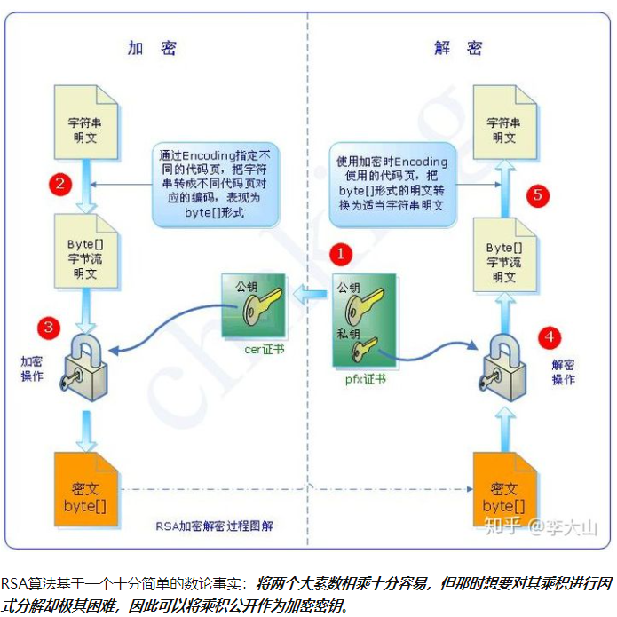

     # 二进制配置kubernetes集群

`权威指南 P64`


# 单节点部署

## 生成证书

master上的`kube-apiserver`、`kube-controller-manager`、`kube-scheduler`进程及各个Node上的`kubelet`、`kube-proxy`进程进行CA签名双向数字证书安全设置

基于CA 签名的双向数字证书的生成过程如下：

* 为`kube-apiserver`生成一个数字证书，并用CA证书签名
* 为`kube-apiserver`进程配置证书相关的启动参数，包括CA证书（用于验证客户端证书的签名真伪）、自己的经过CA签名后的证书及私钥。
* 为每个访问kubernetes api server 的客户端（如 kube-controller-manager、kube-scheduler、kubelet、kube-proxy及调用api server的客户端程序kubectl等）进程都生成自己的数字证书，也都用CA证书签名，在相关程序的启动参数里增加CA证书、自己的证书等相关参数

**需要证书数量**

https://zhuanlan.zhihu.com/p/123858320

```text
[root@k8s-master01 ~]# cd /etc/kubernetes/pki
[root@k8s-master01 pki]# tree
.
├── apiserver.crt
├── apiserver-etcd-client.crt
├── apiserver-etcd-client.key
├── apiserver.key
├── apiserver-kubelet-client.crt
├── apiserver-kubelet-client.key
├── ca.crt
├── ca.key
├── etcd
│   ├── ca.crt
│   ├── ca.key
│   ├── healthcheck-client.crt
│   ├── healthcheck-client.key
│   ├── peer.crt
│   ├── peer.key
│   ├── server.crt
│   └── server.key
├── front-proxy-ca.crt
├── front-proxy-ca.key
├── front-proxy-client.crt
├── front-proxy-client.key
├── sa.key
└── sa.pub

1 directory, 22 files

k8s集群一共有多少证书：
先从Etcd算起：
1、Etcd对外提供服务，要有一套etcd server证书
2、Etcd各节点之间进行通信，要有一套etcd peer证书
3、Kube-APIserver访问Etcd，要有一套etcd client证书

再算kubernetes：
4、Kube-APIserver对外提供服务，要有一套kube-apiserver server证书
5、kube-scheduler、kube-controller-manager、kube-proxy、kubelet和其他可能用到的组件，
   需要访问kube-APIserver，要有一套kube-APIserver client证书
6、kube-controller-manager要生成服务的service account，要有一对用来签署service account的证书(CA证书)
7、kubelet对外提供服务，要有一套kubelet server证书
8、kube-APIserver需要访问kubelet，要有一套kubelet client证书
```

 深入了解证书先了解一下 **公钥，私钥和数字签名** 

```text
总结：公钥和私钥是成对的，它们互相解密。
      公钥加密，私钥解密。
      私钥数字签名，公钥验证。
```


```text
一、公钥加密  假设一下，我找了两个数字，一个是1，一个是2 我喜欢2这个数字，就保留起来，
不告诉你们(私钥），然后我告诉大家，1是我的公钥。

我有一个文件，不能让别人看，我就用1加密了。别人找到了这个文件，但是他不知道2就是解密的私钥啊，
所以他解不开，只有我可以用 数字2，就是我的私钥，来解密。这样我就可以保护数据了。
我的好朋友x用我的公钥1加密了字符a，加密后成了b，放在网上。别人偷到了这个文件，但是别人解不开，
因为别人不知道2就是我的私钥， 只有我才能解密，解密后就得到a。这样，我们就可以传送加密的数据了。

 
二、私钥签名 如果我用私钥加密一段数据（当然只有我可以用私钥加密，因为只有我知道2是我的私钥），
结果所有的人都看到我的内容了，因为他们都知 道我的公钥是1，那么这种加密有什么用处呢？

假如我的好朋友x说有人冒充我给他发信。怎么办呢？我把我要发的信，内容是c，用我的私钥2，加密，
加密后的内容是d，发给x，再告诉他 解密看是不是c。他用我的公钥1解密，发现果然是c。 这个时候，
他会想到，能够用我的公钥解密的数据，必然是用我的私钥加的密。只有我知道我的私钥，
因此他就可以确认确实是我发的东西。 这样我们就能确认发送方身份了。这个过程叫做数字签名。
用私钥来加密数据，用途就是数字签名。
```



### 根证书与证书

```text
通常我们配置https服务时需要到"权威机构"(CA)申请证书。过程是这样的：
1.网站创建一个密钥对，提供公钥和组织以及个人信息给权威机构
2.权威机构颁发证书
3.浏览网页的朋友利用权威机构的根证书公钥解密签名，对比摘要，确定合法性
4.客户端验证域名信息有效时间等（浏览器基本都内置各大权威机构的CA公钥）

这个证书包含如下内容：
1.申请者公钥
2.申请者组织和个人信息
3.签发机构CA信息，有效时间，序列号等
4.以上信息的签名

根证书又名自签名证书，也就是自己给自己颁发的证书。CA(Certificate Authority)被称为证书授权中心，
k8s中的ca证书就是根证书。

密钥对：sa.key sa.pub  根证书：ca.crt etcd/ca.crt  私钥:ca.key 等 其它证书

生成CA证书和私钥
cfssl gencert -initca ca-csr.json | cfssljson -bare ca
ls | grep ca
ca-config.json
ca.csr
ca-csr.json
ca-key.pem
ca.pem
其中ca-key.pem是ca的私钥，ca.csr是一个签署请求，ca.pem是CA证书，是后面kubernetes组件会用到的RootCA。

#Pod中的容器访问API Server(如dashboard容器 访问API Server) 因为Pod的创建、销毁是动态的，所以要为它
手动生成证书就不可行了。K8s使用了Service Account解决Pod 访问API Server的认证问题
默认情况下，每个 namespace 都会有一个 ServiceAccount，如果 Pod 在创建时没有指定 ServiceAccount
就会使用 Pod 所属的 namespace 的 ServiceAccount,默认值/run/secrets/kubernates.io/serviceaccount/
#test 随便查看kube-system命名空间下的pod
  kubectl get pod -n kube-system
  kubectl exec  kube-proxy-cmzp6 -n=kube-system -it -- /bin/sh #进入容器
  cd /run/secrets/kubernates.io/serviceaccount/
  ls #里面有ca.crt(根的证书)   namespace  token 3个文件
  #token是使用 API Server 私钥签名的 JWT（json web token）。用于访问API Server时，Server端认证
  #ca.crt，根证书(是k8s中私有的)。用于Client端验证API Server发送的证书
  #namespace, 标识这个service-account-token的作用域名空间

service Account密钥对 sa.key sa.pub
提供给 kube-controller-manager使用，kube-controller-manager通过 sa.key 对 token 进行签名,
master 节点通过公钥 sa.pub 进行签名的验证 如 kube-proxy 是以 pod 形式运行的, 在 pod 中, 
直接使用 service account 与 kube-apiserver 进行认证, 此时就不需要再单独为 kube-proxy 创建证书了,
会直接使用token校验。
```

### 初始化CA

```
mkdir ssl && cd ssl
cfssl print-defaults config > config.json
cfssl print-defaults csr > csr.json
```

* 创建CA 签名配置文件

  vim ca-config.json

  ```json
  {
    "signing": {
          "default": {
            "expiry": "8760h"
          },
          "profiles": {
            "kubernetes": {
                  "usages": [
                          "signing",
                          "key encipherment",
                          "server auth",
                          "client auth"
                  ],
                  "expiry": "8760h"
            }
          }
    }
  }
  ```

  

* 创建证书签名请求文件

  vim ca-csr.json

  ```json
  {
    "CN": "kubernetes",
    "key": {
          "algo": "rsa",
          "size": 2048
    },
    "names": [
          {
            "C": "CN",
            "ST": "BeiJing",
            "L": "BeiJing",
            "O": "k8s",
            "OU": "System"
          }
    ]
  }
  ```

* 生成CA证书ca.pem和密钥ca-key.pem

  ```shell
  -rw-r--r-- 1 root root  215 Mar 17 07:23 ca-config.json   # 嵌名配置文件
  -rw-r--r-- 1 root root  181 Mar 17 07:24 ca-csr.json      # 初始化证书文件
  -rw------- 1 root root 1679 Mar 17 07:54 ca-key.pem       # ca证书私钥
  -rw-r--r-- 1 root root 1001 Mar 17 07:54 ca.csr           # ca 证书签名文件
  -rw-r--r-- 1 root root 1310 Mar 17 07:54 ca.pem           # ca 证书公钥
  ```

  

### 创建etcd证书

https://github.com/zhangzeng001/k8s/blob/master/cfssl%E7%94%9F%E6%88%90etcd%E8%AF%81%E4%B9%A6.md


### kube-apiserver 的CA证书相关的文件和启动参数


https://www.cnblogs.com/xw115428/p/11955973.html


### kube-controller-manager 的客户端证书、私钥和启动参数


### kube-scheduler 启动参数


### 每个node的客户端证书、私钥和启动参数


### 设置kube-proxy的启动参数


### 设置kubectl客户端使用安全方式访问api server


# 集群高可用


环境准备
    192.168.56.11 linux-node1 linux-node1.example.com   # Kubernetes Master节点/Etcd节点
    192.168.56.12 linux-node2 linux-node2.example.com   # Kubernetes Node节点/Etcd节点
    192.168.56.13 linux-node3 linux-node3.example.com   # Kubernetes Node节点/Etcd节点

系统安装
配置主机名
主机名解析
配置epel源
    rpm -ivh http://mirrors.aliyun.com/epel/epel-release-latest-7.noarch.rpm
	yum install -y net-tools vim lrzsz tree screen lsof tcpdump nc mtr nmap wget
关闭selinux、放火墙、NetworkManager
	systemctl disable firewalld
	systemctl disable NetworkManager
	vim /etc/sysconfig/selinux

克隆机器
文档
	https://github.com/unixhot/salt-k8s

免密钥认证
	ssh-keygen -t rsa

所有机器创建相关目录
	mkdir -p /opt/kubernetes/{cfg,bin,ssl,log}	
	
系统初始化，所有机器安装docker
	cd /etc/yum.repos.d/
	wget https://mirrors.aliyun.com/docker-ce/linux/centos/docker-ce.repo
	yum install -y docker-ce
	systemctl start docker


解压源码包
	cd /usr/local/src/
	unzip k8s-v1.10.1-manual.zip
	cd k8s-v1.10.1-manual/k8s-v1.10.1/
	tar xf kubernetes.tar.gz -C /usr/local/src/
	tar xf kubernetes-server-linux-amd64.tar.gz -C /usr/local/src/
	tar xf kubernetes-client-linux-amd64.tar.gz -C /usr/local/src/
	tar xf kubernetes-node-linux-amd64.tar.gz -C /usr/local/src/

配置环境变量
	grep 'PATH' .bash_profile 
	PATH=$PATH:$HOME/bin:/opt/kubernetes/bin

手动安装ca证书
	chmod +x cfssl*
	mv cfssl-certinfo_linux-amd64 /opt/kubernetes/bin/cfssl-certinfo
	mv cfssljson_linux-amd64  /opt/kubernetes/bin/cfssljson
	mv cfssl_linux-amd64  /opt/kubernetes/bin/cfssl
	
	scp /opt/kubernetes/bin/cfssl* 192.168.56.12:/opt/kubernetes/bin
	scp /opt/kubernetes/bin/cfssl* 192.168.56.13:/opt/kubernetes/bin
	
	cd /usr/local/src/
	mkdir ssl && cd ssl
	cfssl print-defaults config > config.json
	cfssl print-defaults csr > csr.json
	
	vim ca-config.json
	{
	  "signing": {
		"default": {
		  "expiry": "8760h"
		},
		"profiles": {
		  "kubernetes": {
			"usages": [
				"signing",
				"key encipherment",
				"server auth",
				"client auth"
			],
			"expiry": "8760h"
		  }
		}
	  }
	}
	
	vim ca-csr.json
	{
	  "CN": "kubernetes",
	  "key": {
		"algo": "rsa",
		"size": 2048
	  },
	  "names": [
		{
		  "C": "CN",
		  "ST": "BeiJing",
		  "L": "BeiJing",
		  "O": "k8s",
		  "OU": "System"
		}
	  ]
	}
	
	cp ca.csr ca.pem ca-key.pem ca-config.json /opt/kubernetes/ssl
	scp ca.csr ca.pem ca-key.pem ca-config.json 192.168.56.12:/opt/kubernetes/ssl 
	scp ca.csr ca.pem ca-key.pem ca-config.json 192.168.56.13:/opt/kubernetes/ssl

手动创建etcd集群
	tar xf etcd-v3.2.18-linux-amd64.tar.gz -C /usr/local/src/
	cd /usr/local/src/etcd-v3.2.18-linux-amd64/
	cp etcd etcdctl /opt/kubernetes/bin/
	scp etcd etcdctl 192.168.56.12:/opt/kubernetes/bin/
	scp etcd etcdctl 192.168.56.13:/opt/kubernetes/bin/
	
	# 创建etcd证书签名请求
	cd /usr/local/src/ssl/
	vim etcd-csr.json
	{
	  "CN": "etcd",
	  "hosts": [
		"127.0.0.1",
	    "192.168.56.11",
	    "192.168.56.12",
	    "192.168.56.13"
	  ],
	  "key": {
		"algo": "rsa",
		"size": 2048
	  },
	  "names": [
		{
		  "C": "CN",
		  "ST": "BeiJing",
		  "L": "BeiJing",
		  "O": "k8s",
		  "OU": "System"
		}
	  ]
	}
	
	cfssl gencert -ca=/opt/kubernetes/ssl/ca.pem \
	-ca-key=/opt/kubernetes/ssl/ca-key.pem \
	-config=/opt/kubernetes/ssl/ca-config.json \
	-profile=kubernetes etcd-csr.json | cfssljson -bare etcd
	
	cp etcd*.pem /opt/kubernetes/ssl
	scp etcd*.pem 192.168.56.12:/opt/kubernetes/ssl
	scp etcd*.pem 192.168.56.13:/opt/kubernetes/ssl
	
	# 配置文件 ETCD_NAME 必须唯一
		# ETCD_LISTEN_PEER_URLS     2380为集群通信端口，2379为外部访问端口
		# ETCD_LISTEN_CLIENT_URLS
		# ETCD_INITIAL_ADVERTISE_PEER_URLS
		# ETCD_INITIAL_CLUSTER
		# ETCD_INITIAL_CLUSTER_TOKEN
		# ETCD_ADVERTISE_CLIENT_URLS


​	
​	vim /opt/kubernetes/cfg/etcd.conf
​		#[member]
​		ETCD_NAME="etcd-node1"
​		ETCD_DATA_DIR="/var/lib/etcd/default.etcd"
​		#ETCD_SNAPSHOT_COUNTER="10000"
​		#ETCD_HEARTBEAT_INTERVAL="100"
​		#ETCD_ELECTION_TIMEOUT="1000"
​		ETCD_LISTEN_PEER_URLS="https://192.168.56.11:2380"
​		ETCD_LISTEN_CLIENT_URLS="https://192.168.56.11:2379,https://127.0.0.1:2379"
​		#ETCD_MAX_SNAPSHOTS="5"
​		#ETCD_MAX_WALS="5"
​		#ETCD_CORS=""
​		#[cluster]
​		ETCD_INITIAL_ADVERTISE_PEER_URLS="https://192.168.56.11:2380"
​		# if you use different ETCD_NAME (e.g. test),
​		# set ETCD_INITIAL_CLUSTER value for this name, i.e. "test=http://..."
​		ETCD_INITIAL_CLUSTER="etcd-node1=https://192.168.56.11:2380,etcd-node2=https://192.168.56.12:2380,etcd-node3=https://192.168.56.13:2380"
​		ETCD_INITIAL_CLUSTER_STATE="new"
​		ETCD_INITIAL_CLUSTER_TOKEN="k8s-etcd-cluster"
​		ETCD_ADVERTISE_CLIENT_URLS="https://192.168.56.11:2379"
​		#[security]
​		CLIENT_CERT_AUTH="true"
​		ETCD_CA_FILE="/opt/kubernetes/ssl/ca.pem"
​		ETCD_CERT_FILE="/opt/kubernetes/ssl/etcd.pem"
​		ETCD_KEY_FILE="/opt/kubernetes/ssl/etcd-key.pem"
​		PEER_CLIENT_CERT_AUTH="true"
​		ETCD_PEER_CA_FILE="/opt/kubernetes/ssl/ca.pem"
​		ETCD_PEER_CERT_FILE="/opt/kubernetes/ssl/etcd.pem"
​		ETCD_PEER_KEY_FILE="/opt/kubernetes/ssl/etcd-key.pem"


​	
​	# 创建ETCD系统服务
​	vim /etc/systemd/system/etcd.service
​		[Unit]
​		Description=Etcd Server
​		After=network.target
​	
		[Service]
		Type=simple
		WorkingDirectory=/var/lib/etcd
		EnvironmentFile=-/opt/kubernetes/cfg/etcd.conf
		# set GOMAXPROCS to number of processors
		ExecStart=/bin/bash -c "GOMAXPROCS=$(nproc) /opt/kubernetes/bin/etcd"
		Type=notify
	
		[Install]
		WantedBy=multi-user.target
	
	scp /opt/kubernetes/cfg/etcd.conf 192.168.56.12:/opt/kubernetes/cfg/
	scp /etc/systemd/system/etcd.service 192.168.56.12:/etc/systemd/system/
	scp /opt/kubernetes/cfg/etcd.conf 192.168.56.13:/opt/kubernetes/cfg/
	scp /etc/systemd/system/etcd.service 192.168.56.13:/etc/systemd/system/
	
	# 其他节点修改
	vim /opt/kubernetes/cfg/etcd.conf
		ETCD_NAME
		ETCD_LISTEN_PEER_URLS
		ETCD_LISTEN_CLIENT_URLS
		ETCD_INITIAL_ADVERTISE_PEER_URLS
	
	# 在所有节点上创建etcd存储目录并启动etcd
	mkdir /var/lib/etcd
		
	# 重新加载系统服务
	systemctl daemon-reload
	systemctl enable etcd
	
	systemctl start etcd
	systemctl status etcd
	
	集群健康检查
	etcdctl --endpoints=https://192.168.56.11:2379 \
	--ca-file=/opt/kubernetes/ssl/ca.pem \
	--cert-file=/opt/kubernetes/ssl/etcd.pem \
	--key-file=/opt/kubernetes/ssl/etcd-key.pem cluster-health


​	
master节点部署
​    apiserver
​	scheduler
​	controller-manager
​	
​	apiserver 提供集群管理的rest api接口，包括认证授权、数据校验以及集群状态
​	    只有api server才直接操作etcd
​	    其他模块通过api server查询货修改数据
​	    提供其他模块之间的数据交互和通信的枢纽
​	scheduler
​	    监听kube-apiserver，查询还未分配Node的Pod
​	    根据调度策略为这些pod分配节点
​	controller-manager
​	    由一系列的控制器组成，他通过api server监控整个集群的状态，并确保集群处于预期的工作状态


​        
​    部署api server  node1
​    cd /usr/local/src/kubernetes
​    cp server/bin/kube-apiserver /opt/kubernetes/bin/
​    cp server/bin/kube-controller-manager /opt/kubernetes/bin/
​    cp server/bin/kube-scheduler /opt/kubernetes/bin/
​    
        # 生成csr的json配置文件
    cd /usr/local/src/ssl/
    vim kubernetes-csr.json
    {
      "CN": "kubernetes",
      "hosts": [
        "127.0.0.1",
        "192.168.56.11",
        "10.1.0.1",
        "kubernetes",
        "kubernetes.default",
        "kubernetes.default.svc",
        "kubernetes.default.svc.cluster",
        "kubernetes.default.svc.cluster.local"
      ],
      "key": {
        "algo": "rsa",
        "size": 2048
      },
      "names": [
        {
          "C": "CN",
          "ST": "BeiJing",
          "L": "BeiJing",
          "O": "k8s",
          "OU": "System"
        }
      ]
    }
    
    cfssl gencert -ca=/opt/kubernetes/ssl/ca.pem \
    -ca-key=/opt/kubernetes/ssl/ca-key.pem \
    -config=/opt/kubernetes/ssl/ca-config.json \
    -profile=kubernetes kubernetes-csr.json | cfssljson -bare kubernetes
    
    cp kubernetes*.pem /opt/kubernetes/ssl/
    scp kubernetes*.pem 192.168.56.12:/opt/kubernetes/ssl/
    scp kubernetes*.pem 192.168.56.13:/opt/kubernetes/ssl/
    
        # 创建 kube-apiserver 使用的客户端 token 文件
    [root@linux-node1 ~]#  head -c 16 /dev/urandom | od -An -t x | tr -d ' '
    ad6d5bb607a186796d8861557df0d17f 
    [root@linux-node1 ~]# vim /opt/kubernetes/ssl/bootstrap-token.csv
    ad6d5bb607a186796d8861557df0d17f,kubelet-bootstrap,10001,"system:kubelet-bootstrap"
    
        # 创建基础用户名/密码认证配置
    vim /opt/kubernetes/ssl/basic-auth.csv
        admin,admin,1
        readonly,readonly,2


​    
​        # 部署Kubernetes API Server启动文件
​    vim /usr/lib/systemd/system/kube-apiserver.service
​    #########################
​    [Unit]
​    Description=Kubernetes API Server
​    Documentation=https://github.com/GoogleCloudPlatform/kubernetes
​    After=network.target
​    
    [Service]
    ExecStart=/opt/kubernetes/bin/kube-apiserver \
      --admission-control=NamespaceLifecycle,LimitRanger,ServiceAccount,DefaultStorageClass,ResourceQuota,NodeRestriction \
      --bind-address=192.168.56.11 \
      --insecure-bind-address=127.0.0.1 \
      --authorization-mode=Node,RBAC \
      --runtime-config=rbac.authorization.k8s.io/v1 \
      --kubelet-https=true \
      --anonymous-auth=false \
      --basic-auth-file=/opt/kubernetes/ssl/basic-auth.csv \
      --enable-bootstrap-token-auth \
      --token-auth-file=/opt/kubernetes/ssl/bootstrap-token.csv \
      --service-cluster-ip-range=10.1.0.0/16 \
      --service-node-port-range=20000-40000 \
      --tls-cert-file=/opt/kubernetes/ssl/kubernetes.pem \
      --tls-private-key-file=/opt/kubernetes/ssl/kubernetes-key.pem \
      --client-ca-file=/opt/kubernetes/ssl/ca.pem \
      --service-account-key-file=/opt/kubernetes/ssl/ca-key.pem \
      --etcd-cafile=/opt/kubernetes/ssl/ca.pem \
      --etcd-certfile=/opt/kubernetes/ssl/kubernetes.pem \
      --etcd-keyfile=/opt/kubernetes/ssl/kubernetes-key.pem \
      --etcd-servers=https://192.168.56.11:2379,https://192.168.56.12:2379,https://192.168.56.13:2379 \
      --enable-swagger-ui=true \
      --allow-privileged=true \
      --audit-log-maxage=30 \
      --audit-log-maxbackup=3 \
      --audit-log-maxsize=100 \
      --audit-log-path=/opt/kubernetes/log/api-audit.log \
      --event-ttl=1h \
      --v=2 \
      --logtostderr=false \
      --log-dir=/opt/kubernetes/log
    Restart=on-failure
    RestartSec=5
    Type=notify
    LimitNOFILE=65536
    
    [Install]
    WantedBy=multi-user.target
    ##########################
    
        # 启动API Server服务
    systemctl daemon-reload
    systemctl enable kube-apiserver
    systemctl start kube-apiserver
    
    [root@linux-node1 ssl]# netstat -lntup|grep kube-apiserve
    tcp        0      0 192.168.56.11:6443      0.0.0.0:*               LISTEN      18670/kube-apiserve 
    tcp        0      0 127.0.0.1:8080          0.0.0.0:*               LISTEN      18670/kube-apiserve 
    6443  -->  其他服务访问端口
    8080  -->  kube-controller-manager  kube-scheduler访问同一台机器通过127.0.0.1即可访问到


​    
​    部署Controller Manager服务
​    vim /usr/lib/systemd/system/kube-controller-manager.service
​    [Unit]
​    Description=Kubernetes Controller Manager
​    Documentation=https://github.com/GoogleCloudPlatform/kubernetes
​    
    [Service]
    ExecStart=/opt/kubernetes/bin/kube-controller-manager \
      --address=127.0.0.1 \
      --master=http://127.0.0.1:8080 \
      --allocate-node-cidrs=true \
      --service-cluster-ip-range=10.1.0.0/16 \
      --cluster-cidr=10.2.0.0/16 \
      --cluster-name=kubernetes \
      --cluster-signing-cert-file=/opt/kubernetes/ssl/ca.pem \
      --cluster-signing-key-file=/opt/kubernetes/ssl/ca-key.pem \
      --service-account-private-key-file=/opt/kubernetes/ssl/ca-key.pem \
      --root-ca-file=/opt/kubernetes/ssl/ca.pem \
      --leader-elect=true \
      --v=2 \
      --logtostderr=false \
      --log-dir=/opt/kubernetes/log
    
    Restart=on-failure
    RestartSec=5
    
    [Install]
    WantedBy=multi-user.target
    
        # 启动Controller Manager
    systemctl daemon-reload
    systemctl enable kube-controller-manager
    systemctl start kube-controller-manager
    systemctl status kube-controller-manager
    
    [root@linux-node1 ssl]# netstat -lntup|grep kube-controll
    tcp        0      0 127.0.0.1:10252         0.0.0.0:*               LISTEN      18725/kube-controll


​    
​    部署Kubernetes Scheduler
​    vim /usr/lib/systemd/system/kube-scheduler.service
​    [Unit]
​    Description=Kubernetes Scheduler
​    Documentation=https://github.com/GoogleCloudPlatform/kubernetes
​    
    [Service]
    ExecStart=/opt/kubernetes/bin/kube-scheduler \
      --address=127.0.0.1 \
      --master=http://127.0.0.1:8080 \
      --leader-elect=true \
      --v=2 \
      --logtostderr=false \
      --log-dir=/opt/kubernetes/log
    
    Restart=on-failure
    RestartSec=5
    
    [Install]
    WantedBy=multi-user.target
    
    systemctl daemon-reload
    systemctl enable kube-scheduler
    systemctl start kube-scheduler
    systemctl status kube-scheduler
    
    [root@linux-node1 ssl]# netstat -lntup|grep kube-schedule 
    tcp        0      0 127.0.0.1:10251         0.0.0.0:*               LISTEN      18781/kube-schedule


​    
​    部署kubectl命令行工具
​    cd /usr/local/src/kubernetes/client/bin/
​    cp kubectl /opt/kubernetes/bin/
​    scp kubectl 192.168.56.12:/opt/kubernetes/bin/
​    scp kubectl 192.168.56.13:/opt/kubernetes/bin/
​    
    # 为kubectl创建admin证书
    cd /usr/local/src/ssl/
    vim admin-csr.json
    {
      "CN": "admin",
      "hosts": [],
      "key": {
    	"algo": "rsa",
    	"size": 2048
      },
      "names": [
    	{
    	  "C": "CN",
    	  "ST": "BeiJing",
    	  "L": "BeiJing",
    	  "O": "system:masters",
    	  "OU": "System"
    	}
      ]
    }


​    
​    cfssl gencert -ca=/opt/kubernetes/ssl/ca.pem \
​    -ca-key=/opt/kubernetes/ssl/ca-key.pem \
​    -config=/opt/kubernetes/ssl/ca-config.json \
​    -profile=kubernetes admin-csr.json | cfssljson -bare admin
​       
    ls -l admin*
    cp admin*.pem /opt/kubernetes/ssl/
    
    设置集群参数
    kubectl config set-cluster kubernetes \
    --certificate-authority=/opt/kubernetes/ssl/ca.pem \
    --embed-certs=true \
    --server=https://192.168.56.11:6443
    
    设置客户端认证参数
     kubectl config set-credentials admin \
    --client-certificate=/opt/kubernetes/ssl/admin.pem \
    --embed-certs=true \
    --client-key=/opt/kubernetes/ssl/admin-key.pem
    
    设置上下文参数
    kubectl config set-context kubernetes \
    --cluster=kubernetes \
    --user=admin
       
    设置默认上下文
    kubectl config use-context kubernetes
    
    家目录生成vim .kube/config文件，其他节点要使用kubectl则需要拷贝该文件
    
    使用kubectl工具
    kubectl get cs


部署kubelet
    二进制包准备 将软件包从linux-node1复制到linux-node2中去。
	cd /usr/local/src/kubernetes/server/bin/
    cp kubelet kube-proxy /opt/kubernetes/bin/
    scp kubelet kube-proxy 192.168.56.12:/opt/kubernetes/bin/
    scp kubelet kube-proxy 192.168.56.13:/opt/kubernetes/bin/

    创建角色绑定
    kubectl create clusterrolebinding kubelet-bootstrap --clusterrole=system:node-bootstrapper --user=kubelet-bootstrap
    
    创建 kubelet bootstrapping kubeconfig 文件 设置集群参数
    cd /usr/local/src/ssl/
    kubectl config set-cluster kubernetes \
    --certificate-authority=/opt/kubernetes/ssl/ca.pem \
    --embed-certs=true \
    --server=https://192.168.56.11:6443 \
    --kubeconfig=bootstrap.kubeconfig
    
    设置客户端认证参数
    kubectl config set-credentials kubelet-bootstrap \
    --token=ad6d5bb607a186796d8861557df0d17f \
    --kubeconfig=bootstrap.kubeconfig
    
    设置上下文参数
    kubectl config set-context default \
    --cluster=kubernetes \
    --user=kubelet-bootstrap \
    --kubeconfig=bootstrap.kubeconfig
       
    选择默认上下文
    kubectl config use-context default --kubeconfig=bootstrap.kubeconfig
    cp bootstrap.kubeconfig /opt/kubernetes/cfg
    scp bootstrap.kubeconfig 192.168.56.12:/opt/kubernetes/cfg
    scp bootstrap.kubeconfig 192.168.56.13:/opt/kubernetes/cfg
    
    部署kubelet 1.设置CNI支持
    mkdir -p /etc/cni/net.d # node机器都创建
    vim /etc/cni/net.d/10-default.conf
    {
            "name": "flannel",
            "type": "flannel",
            "delegate": {
                "bridge": "docker0",
                "isDefaultGateway": true,
                "mtu": 1400
            }
    }
    scp /etc/cni/net.d/10-default.conf 192.168.56.12:/etc/cni/net.d/10-default.conf
    scp /etc/cni/net.d/10-default.conf 192.168.56.13:/etc/cni/net.d/10-default.conf


​    
​    创建kubelet目录
​    mkdir /var/lib/kubelet  # 3台机器都创建
​    vim /usr/lib/systemd/system/kubelet.service
​    [Unit]
​    Description=Kubernetes Kubelet
​    Documentation=https://github.com/GoogleCloudPlatform/kubernetes
​    After=docker.service
​    Requires=docker.service
​    
    [Service]
    WorkingDirectory=/var/lib/kubelet
    ExecStart=/opt/kubernetes/bin/kubelet \
      --address=192.168.56.12 \
      --hostname-override=192.168.56.12 \
      --pod-infra-container-image=mirrorgooglecontainers/pause-amd64:3.0 \
      --experimental-bootstrap-kubeconfig=/opt/kubernetes/cfg/bootstrap.kubeconfig \
      --kubeconfig=/opt/kubernetes/cfg/kubelet.kubeconfig \
      --cert-dir=/opt/kubernetes/ssl \
      --network-plugin=cni \
      --cni-conf-dir=/etc/cni/net.d \
      --cni-bin-dir=/opt/kubernetes/bin/cni \
      --cluster-dns=10.1.0.2 \
      --cluster-domain=cluster.local. \
      --hairpin-mode hairpin-veth \
      --allow-privileged=true \
      --fail-swap-on=false \
      --logtostderr=true \
      --v=2 \
      --logtostderr=false \
      --log-dir=/opt/kubernetes/log
    Restart=on-failure
    RestartSec=5
    
    scp /usr/lib/systemd/system/kubelet.service 192.168.56.12:/usr/lib/systemd/system/kubelet.service
    scp /usr/lib/systemd/system/kubelet.service 192.168.56.13:/usr/lib/systemd/system/kubelet.service
    
    systemctl daemon-reload
    systemctl enable kubelet
    systemctl start kubelet
    
    查看服务状态
    systemctl status kubelet
    
    查看csr请求 注意是在linux-node1上执行。
    kubectl get csr
        NAME                                                   AGE       REQUESTOR           CONDITION
        node-csr-7bn3loQ2oZv7QYwxLfoepPtSjR-EIRJry7VThzrLs_0   2m        kubelet-bootstrap   Pending
        node-csr-QQ4cxrfyr0a4Wy8-3GsUyU1rKBIIJ0vq3y5ktIInPqM   2m        kubelet-bootstrap   Pending
    批准kubelet 的 TLS 证书请求 注意是在linux-node1上执行。
    kubectl get csr|grep 'Pending' | awk 'NR>0{print $1}'| xargs kubectl certificate approve
    
    执行完毕后，查看节点状态已经是Ready的状态了 [root@linux-node1 ssl]# kubectl get node NAME STATUS ROLES AGE VERSION

部署Kubernetes Proxy
    配置kube-proxy使用LVS
    yum install -y ipvsadm ipset conntrack
    
    创建 kube-proxy 证书请求
    cd /usr/local/src/ssl/
    vim kube-proxy-csr.json
    {
      "CN": "system:kube-proxy",
      "hosts": [],
      "key": {
        "algo": "rsa",
        "size": 2048
      },
      "names": [
        {
          "C": "CN",
          "ST": "BeiJing",
          "L": "BeiJing",
          "O": "k8s",
          "OU": "System"
        }
      ]
    }
    
    生成证书
    cfssl gencert -ca=/opt/kubernetes/ssl/ca.pem \
    -ca-key=/opt/kubernetes/ssl/ca-key.pem \
    -config=/opt/kubernetes/ssl/ca-config.json \
    -profile=kubernetes  kube-proxy-csr.json | cfssljson -bare kube-proxy
    
    分发证书到所有Node节点
    cp kube-proxy*.pem /opt/kubernetes/ssl/
    scp kube-proxy*.pem 192.168.56.12:/opt/kubernetes/ssl/
    scp kube-proxy*.pem 192.168.56.12:/opt/kubernetes/ssl/
    
    创建kube-proxy配置文件
    kubectl config set-cluster kubernetes \
    --certificate-authority=/opt/kubernetes/ssl/ca.pem \
    --embed-certs=true \
    --server=https://192.168.56.11:6443 \
    --kubeconfig=kube-proxy.kubeconfig
    
    kubectl config set-credentials kube-proxy \
    --client-certificate=/opt/kubernetes/ssl/kube-proxy.pem \
    --client-key=/opt/kubernetes/ssl/kube-proxy-key.pem \
    --embed-certs=true \
    --kubeconfig=kube-proxy.kubeconfig
    
    kubectl config set-context default \
    --cluster=kubernetes \
    --user=kube-proxy \
    --kubeconfig=kube-proxy.kubeconfig
    
    kubectl config use-context default --kubeconfig=kube-proxy.kubeconfig
    
    分发kubeconfig配置文件
    cp kube-proxy.kubeconfig /opt/kubernetes/cfg/
    scp kube-proxy.kubeconfig 192.168.56.12:/opt/kubernetes/cfg/
    scp kube-proxy.kubeconfig 192.168.56.13:/opt/kubernetes/cfg/
    
    创建kube-proxy服务配置 两台机器都创建
    mkdir /var/lib/kube-proxy
    vim /usr/lib/systemd/system/kube-proxy.service
    [Unit]
    Description=Kubernetes Kube-Proxy Server
    Documentation=https://github.com/GoogleCloudPlatform/kubernetes
    After=network.target
    
    [Service]
    WorkingDirectory=/var/lib/kube-proxy
    ExecStart=/opt/kubernetes/bin/kube-proxy \
      --bind-address=192.168.56.12 \
      --hostname-override=192.168.56.12 \
      --kubeconfig=/opt/kubernetes/cfg/kube-proxy.kubeconfig \
    --masquerade-all \
      --feature-gates=SupportIPVSProxyMode=true \
      --proxy-mode=ipvs \
      --ipvs-min-sync-period=5s \
      --ipvs-sync-period=5s \
      --ipvs-scheduler=rr \
      --logtostderr=true \
      --v=2 \
      --logtostderr=false \
      --log-dir=/opt/kubernetes/log
    
    Restart=on-failure
    RestartSec=5
    LimitNOFILE=65536
    
    [Install]
    WantedBy=multi-user.target


​    
​    
​    启动Kubernetes Proxy
​    systemctl daemon-reload
​    systemctl enable kube-proxy
​    systemctl start kube-proxy
​    
    查看服务状态 查看kube-proxy服务状态
    systemctl status kube-proxy
    ipvsadm -L -n
    
    如果你在两台实验机器都安装了kubelet和proxy服务，使用下面的命令可以检查状态：
    [root@linux-node1 ssl]#  kubectl get node
    NAME            STATUS    ROLES     AGE       VERSION
    192.168.56.12   Ready     <none>    22m       v1.10.1
    192.168.56.13   Ready     <none>    3m        v1.10.1


​    
​    
网络------------    
​    
RC ----   RS ---- deployment
​    replication controller
​        rc是K8s集群中最早的保证pod高可用的api对象。通过监控运行中pod来保证集群中运行指定数目的pod副本
​        指定的数目可以是多个也可以是1个；少于指定数目，rc就启动运行新的pod副本；多于指定数目，rc就会杀死多余的pod副本
​        即使在指定数目为1的情况下，通过rc运行pod也比直接运行pod更明智，因为rc也可以发挥高可用的能力，保证永远有1个pod在运行
​        
​    replica Set
​        RS是新一代的RC，提供同样的高可用能力，区别主要在于RS后来居上，能支持更多中的匹配模式。副本集对象一般不单独使用，而是作为部署的理想状态参数使用。
​        
        K8s 1.2中出现的概念，是RC的升级。一般和Deployment共同使用
        
    Deploment  *****
        Deploment表示用户对K8s集群的一次更新操作。Deployment是一个比RS应用模式更广的api对象
        可以是创建一个新的服务，更新一个新的服务，也可以是滚动升级一个服务。滚动升级一个服务，实际是创建一个新的RS，然后逐渐将新的RS中副本数增加到理想状态，将旧RS中的副本数缩小到0的副本操作
        
        这样一个复合操作用一个RS是不好描述的，所以用一个更通用的Deployment来描述

service
    RC、RS和Deployment只是保证了支撑服务的pod的输量，但是没有解决如何访问这些服务的问题。一个Pod只是运行一个服务的实例，随时可能在一个节点上停止，在另一个节点以一个新的IP启动一个新的Pod，因此不能以确定的IP和端口号提供服务。
    
    要稳定地提供服务需要服务发现和负载均衡能力。服务发现完成的工作，是正对客户端访问的服务，找到对应的后端服务实例
    
    在K8s集群中，客户端需要访问的服务就是Service对象。每个Service会对赢一个集群内部有限的虚拟IP，集群内部通过虚拟IP访问一个服务


K8s的IP地址
    Node IP：节点设备的IP，如物理机，虚拟机等容器宿主的实际IP
    Pod IP： Pod的ip地址，是根据docker0网络IP段进行分配的。
    cluster IP： Service的IP，是一个虚拟IP，仅用于service对象，有K8s管理和分配，需要结合service port才能使用，单独的ip没有通信功能，集群外访问需要一些修改
    在k8s集群内部，node ip 、pod ip、cluster ip的通信机制是有k8s指定的路由规则，不是ip路由


​    
Flannel安装
​    为flunnel生成证书
​    cd /usr/local/src/ssl/
​    vim flanneld-csr.json
​    {
​      "CN": "flanneld",
​      "hosts": [],
​      "key": {
​        "algo": "rsa",
​        "size": 2048
​      },
​      "names": [
​        {
​          "C": "CN",
​          "ST": "BeiJing",
​          "L": "BeiJing",
​          "O": "k8s",
​          "OU": "System"
​        }
​      ]
​    }
​    
​    生成证书
​    cfssl gencert -ca=/opt/kubernetes/ssl/ca.pem \
​    -ca-key=/opt/kubernetes/ssl/ca-key.pem \
​    -config=/opt/kubernetes/ssl/ca-config.json \
​    -profile=kubernetes flanneld-csr.json | cfssljson -bare flanneld
​    
    分发证书
    cp flanneld*.pem /opt/kubernetes/ssl/
    scp flanneld*.pem 192.168.56.12:/opt/kubernetes/ssl/
    scp flanneld*.pem 192.168.56.13:/opt/kubernetes/ssl/
    
    解压flannel包
    tar xf flannel-v0.10.0-linux-amd64.tar.gz -C /usr/local/src/
    cp flanneld mk-docker-opts.sh /opt/kubernetes/bin/
    scp flanneld mk-docker-opts.sh 192.168.56.12:/opt/kubernetes/bin/
    scp flanneld mk-docker-opts.sh 192.168.56.13:/opt/kubernetes/bin/
    
    cd /usr/local/src/kubernetes/cluster/centos/node/bin/
    cp remove-docker0.sh /opt/kubernetes/bin/
    scp remove-docker0.sh 192.168.56.12:/opt/kubernetes/bin/
    scp remove-docker0.sh 192.168.56.13:/opt/kubernetes/bin/


​    
​    配置Flannel
​    vim /opt/kubernetes/cfg/flannel
​    FLANNEL_ETCD="-etcd-endpoints=https://192.168.56.11:2379,https://192.168.56.12:2379,https://192.168.56.13:2379"
​    FLANNEL_ETCD_KEY="-etcd-prefix=/kubernetes/network"
​    FLANNEL_ETCD_CAFILE="--etcd-cafile=/opt/kubernetes/ssl/ca.pem"
​    FLANNEL_ETCD_CERTFILE="--etcd-certfile=/opt/kubernetes/ssl/flanneld.pem"
​    FLANNEL_ETCD_KEYFILE="--etcd-keyfile=/opt/kubernetes/ssl/flanneld-key.pem"
​    
    scp /opt/kubernetes/cfg/flannel 192.168.56.12:/opt/kubernetes/cfg/
    scp /opt/kubernetes/cfg/flannel 192.168.56.13:/opt/kubernetes/cfg/
    
    设置Flannel系统服务
    vim /usr/lib/systemd/system/flannel.service
    [Unit]
    Description=Flanneld overlay address etcd agent
    After=network.target
    Before=docker.service
    
    [Service]
    EnvironmentFile=-/opt/kubernetes/cfg/flannel
    ExecStartPre=/opt/kubernetes/bin/remove-docker0.sh
    ExecStart=/opt/kubernetes/bin/flanneld ${FLANNEL_ETCD} ${FLANNEL_ETCD_KEY} ${FLANNEL_ETCD_CAFILE} ${FLANNEL_ETCD_CERTFILE} ${FLANNEL_ETCD_KEYFILE}
    ExecStartPost=/opt/kubernetes/bin/mk-docker-opts.sh -d /run/flannel/docker
    
    Type=notify
    
    [Install]
    WantedBy=multi-user.target
    RequiredBy=docker.service


​    
​    scp /usr/lib/systemd/system/flannel.service 192.168.56.12:/usr/lib/systemd/system/
​    scp /usr/lib/systemd/system/flannel.service 192.168.56.13:/usr/lib/systemd/system/

Flannel CNI集成
    下载CNI插件
    mkdir /opt/kubernetes/bin/cni
    tar zxf cni-plugins-amd64-v0.7.1.tgz -C /opt/kubernetes/bin/cni
    scp -r /opt/kubernetes/bin/cni/* 192.168.56.12:/opt/kubernetes/bin/cni/
    scp -r /opt/kubernetes/bin/cni/* 192.168.56.13:/opt/kubernetes/bin/cni/
    
    创建Etcd的key
    /opt/kubernetes/bin/etcdctl --ca-file /opt/kubernetes/ssl/ca.pem --cert-file /opt/kubernetes/ssl/flanneld.pem --key-file /opt/kubernetes/ssl/flanneld-key.pem \
      --no-sync -C https://192.168.56.11:2379,https://192.168.56.12:2379,https://192.168.56.13:2379 \
    mk /kubernetes/network/config '{ "Network": "10.2.0.0/16", "Backend": { "Type": "vxlan", "VNI": 1 }}' >/dev/null 2>&1
    
    启动flannel
    systemctl daemon-reload
    systemctl enable flannel
    chmod +x /opt/kubernetes/bin/*
    systemctl start flannel

配置Docker使用Flannel
    
    
    
    
    
    
kubectl get deployment
查看详情
    kubectl describe deployment nginx-deployment

查看kubectl get pod的信息
    kubectl describe pod nginx-deployment-6c45fc49cb-sv9kr


相关命令
    创建服务deployment
    kubectl create -f nginx-deployment.yaml
    
    查看deployment
    kubectl get deployment
    
    查看pod
    kubectl get pod -o wide
    
    测试pod访问
    curl --head 10.2.83.17
    
    更新deployment
    kubectl set image deployment/nginx-deployment nginx=nginx:1.12.2 --record
    
    查看更新后的deployment
    kubectl get deployment -o wide
    
    查看更新历史
    kubectl rollout history deployment/nginx-deployment
    
    查看具体某一个版本的升级历史
    kubectl rollout history deployment/nginx-deployment --revision=1
    
    快速回滚到上一个版本
    kubectl rollout undo deployment/nginx-deployment
    
    扩容到5个节点
    kubectl scale deployment nginx-deployment 5

kubectl --help


